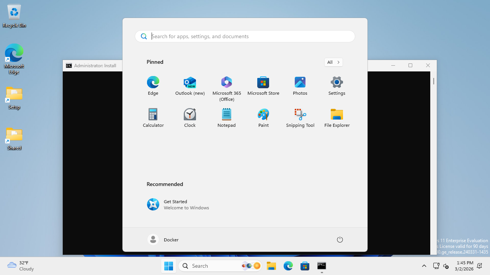

# Claude Code Instructions for openadapt-evals

## MANDATORY: Branches and Pull Requests

**NEVER push directly to main. ALWAYS use feature branches and pull requests.**

1. Create a feature branch: `git checkout -b feat/description` or `fix/description`
2. Make commits on the branch
3. Push the branch: `git push -u origin branch-name`
4. Create a PR: `gh pr create --title "..." --body "..."`
5. Only merge via PR (never `git push origin main`)

This is a hard rule with NO exceptions, even for "small" changes.

## MANDATORY: Never Remove Worktrees You Didn't Create

**NEVER run `git worktree remove` or `git worktree prune` without confirming no other sessions are using them.**

Removing a worktree that another Claude session is using as its working directory **kills that session permanently** — every command fails with "Working directory no longer exists" and the session cannot recover. Uncommitted work is lost.

Before removing ANY worktree:
1. **Ask the user** if other agents/sessions are running
2. Only remove worktrees **you created in this session**
3. Never batch-remove worktrees — each one could be another session's home

This rule also applies to `git clean`, `rm -rf` on worktree paths, and any operation that deletes directories under `.claude/worktrees/`.

### PR Titles MUST Use Conventional Commit Format

PR titles become the squash merge commit message on main. `python-semantic-release` parses these to decide version bumps. **If the PR title doesn't follow the format, no release is created.**

```
fix: short description          → patch bump (0.0.x)
feat: short description         → minor bump (0.x.0)
fix(scope): short description   → patch bump with scope
feat!: breaking change          → major bump (x.0.0)
```

**Types**: feat, fix, docs, style, refactor, perf, test, chore, ci

**Rules**: Lowercase type, colon+space, imperative mood, no period, max 72 chars.

**Examples**:
- `fix: guard empty metric_results in evaluate endpoint`
- `feat: add demo-conditioned evaluation script`
- `fix(agent): return error instead of done on CU agent failures`

**Wrong** (will NOT trigger a release):
- `Fix scoring and agent error handling` (no `fix:` prefix)
- `Update PolicyAgent` (no type prefix)

When merging with `gh pr merge --squash`, GitHub uses the PR title as the commit message — so the title format is what matters.

---

## Project Status

**Before starting work**, read the project-wide status document:
- **Location**: `/Users/abrichr/oa/src/STATUS.md`
- Tracks P0 priorities, active tasks, blockers, and strategic decisions

---

## Overview

Governed desktop agent evaluation and training infrastructure. Provides benchmark adapters, agent interfaces (including dual-model planner-grounder), VM management (Azure + AWS), RL training integration (TRL GRPO, AReaL), workflow extraction from recordings, PII scrubbing middleware, correction capture, and result visualization. Primary benchmark target is WAA (Windows Agent Arena).

## Quick Start

```bash
# Install
uv sync

# Mock evaluation (no VM required)
openadapt-evals mock --tasks 10

# Live evaluation (uses localhost:5001 by default)
openadapt-evals run --agent api-claude --task notepad_1

# Full control
openadapt-evals live --agent api-claude --server http://localhost:5001 --task-ids notepad_1
```

---

## WAA Benchmark Workflow

### Architecture

```
LOCAL MACHINE                          AZURE VM (Ubuntu)
+-----------------------+              +------------------------+
|  oa-vm CLI            |  SSH Tunnel  |  Docker                |
|  (pool management)    | -----------> |  +- QEMU (Win 11)     |
|                       |  :5001->:5000|     +- WAA Flask API   |
|  openadapt-evals      |  :8006->:8006|     +- Agent           |
|  (benchmark runner)   |              |                        |
+-----------------------+              +------------------------+
```

Two CLI entry points:
- `openadapt-evals` -- benchmark execution (run, mock, live, view, probe)
- `oa-vm` -- VM and pool management (pool-create, pool-wait, vm setup-waa, etc.)

SSH tunnels are required (Azure NSG blocks direct port access). The `vm monitor` command manages them automatically.

### Step-by-Step

All commands run from `/Users/abrichr/oa/src/openadapt-evals`.

```bash
# 1. Create VM(s)
oa-vm pool-create --workers 1       # single VM
oa-vm pool-create --workers 3       # parallel

# 2. Wait for WAA ready
oa-vm pool-wait

# 3. Run benchmark
openadapt-evals run --agent api-claude --task notepad_1     # single task
openadapt-evals run --agent noop --task notepad_1           # smoke test (no API key)
oa-vm pool-run --tasks 10                                   # distributed across pool

# 4. View results
openadapt-evals view --run-name live_eval

# 5. Cleanup (stop billing)
oa-vm pool-cleanup -y
```

### Key Points

1. Default server is `localhost:5001` (matches SSH tunnel to VM:5000)
2. WAA runs inside Windows (QEMU inside Docker on the Ubuntu VM)
3. Results stored in `benchmark_results/`
4. Use `oa-vm vm setup-waa` for WAA container deployment on a VM (15-20 min fresh, 2-5 min existing)

### AWS Support

WAA also runs on AWS EC2 using the same pool commands with `--cloud aws`.

**Auth**: Uses boto3's default credential chain. SSO is recommended: `aws configure sso` (one-time), then `aws sso login` before each session. Static keys (`AWS_ACCESS_KEY_ID`) also work.

```bash
# Verify AWS setup (read-only, free)
oa-vm smoke-test-aws

# Full lifecycle test (creates/deletes a real instance, ~$0.01)
oa-vm smoke-test-aws --full

# Production pool on AWS
oa-vm pool-create --cloud aws --workers 1
oa-vm pool-wait --cloud aws --timeout 45
oa-vm pool-cleanup --cloud aws -y
```

AWS uses `m8i.2xlarge` (~$0.46/hr) for KVM/QEMU nested virtualization (Intel Xeon 6 families C8i/M8i/R8i support nested virt on standard instances since late 2025). First boot takes ~35 min (Windows download + install). Costs per full WAA stack test:

| Phase | Time | Cost |
|-------|------|------|
| VM + Docker setup | ~14 min | $0.11 |
| Docker image build | ~7 min | $0.05 |
| Windows install + boot | ~20 min | $0.15 |
| Benchmark runtime | varies | $0.46/hr |



---

## CLI Reference

### Benchmark CLI (`openadapt-evals`)

| Command    | Description                                 |
|------------|---------------------------------------------|
| `run`      | Live evaluation (localhost:5001 default)     |
| `mock`     | Mock adapter, no VM required                 |
| `live`     | Live WAA server, full control                |
| `probe`    | Check if WAA server is ready                 |
| `view`     | Generate HTML viewer for results             |
| `estimate` | Estimate Azure costs                         |
| `dashboard`| Generate VM usage dashboard                  |
| `up`       | All-in-one: start VM + WAA + wait            |

### VM/Pool CLI (`oa-vm`)

| Command          | Description                            |
|------------------|----------------------------------------|
| `pool-create`    | Create N VMs with Docker and WAA       |
| `pool-wait`      | Wait until WAA is ready on all workers |
| `pool-run`       | Distribute tasks across pool workers   |
| `pool-status`    | Show status of all pool VMs            |
| `pool-vnc`       | Open VNC to pool workers               |
| `pool-logs`      | Stream logs from all workers           |
| `pool-cleanup`   | Delete all pool VMs and resources      |
| `vm monitor`     | Dashboard with SSH tunnels             |
| `vm setup-waa`   | Deploy WAA container on a VM           |
| `create`         | Create single VM                       |
| `delete`         | Delete VM and all resources            |
| `status`         | Show VM status and IP                  |
| `deallocate`     | Stop VM (preserves disk, stops billing)|
| `smoke-test-aws` | Smoke-test AWS backend (credentials, AMI, VPC, lifecycle) |

Run `oa-vm --help` for the full list of 50+ commands.

### `run` Command Defaults

- `--server http://localhost:5001`
- `--max-steps 15`
- `--output benchmark_results`
- `--run-name live_eval`

---

## Architecture

```
openadapt_evals/
+-- agents/                    # Agent implementations
|   +-- base.py                #   BenchmarkAgent ABC
|   +-- api_agent.py           #   ApiAgent (Claude, GPT) with demo persistence
|   +-- planner_grounder_agent.py  # PlannerGrounderAgent (dual-model)
|   +-- retrieval_agent.py     #   RetrievalAugmentedAgent
|   +-- policy_agent.py        #   PolicyAgent (trained models)
|   +-- claude_computer_use_agent.py  # Claude CU native agent
+-- adapters/                  # Benchmark adapters
|   +-- base.py                #   BenchmarkAdapter ABC + data classes
|   +-- waa/                   #   WAA live + mock adapters
|   +-- local/                 #   LocalAdapter (native desktop, no VM)
|   +-- rl_env.py              #   RLEnvironment (Gymnasium-style wrapper)
|   +-- scrub_middleware.py    #   ScrubMiddleware (PII removal)
|   +-- verl_env.py            #   verl-compatible environment wrapper
+-- openenv/                   # OpenEnv-compatible environment
|   +-- environment.py         #   WAAOpenEnvEnvironment
|   +-- models.py              #   WAAAction, WAAObservation, WAAState
|   +-- server.py              #   HTTP+WebSocket server
+-- training/                  # RL training infrastructure
|   +-- trl_rollout.py         #   TRL GRPOTrainer rollout_func
|   +-- areal_workflow.py      #   AReaL AgentWorkflow wrapper
|   +-- trajectory_logger.py   #   PlannerTrajectoryLogger (SFT data)
|   +-- planner_cache.py       #   PlannerCache (pHash-based dedup)
+-- workflow/                  # Workflow extraction pipeline
|   +-- models.py              #   Pydantic models (Recording, Transcript, Workflow)
|   +-- pipeline/              #   4-pass pipeline
|   |   +-- scrub.py           #     Pass 0: PII scrubbing
|   |   +-- transcript.py      #     Pass 1: VLM transcript generation
|   |   +-- extract.py         #     Pass 2: Structured workflow extraction
|   |   +-- match.py           #     Pass 3: Cosine similarity matching
|   +-- adapters/              #   Recording source adapters
|       +-- waa.py             #     WAA VNC recording adapter
+-- evaluation/                # Evaluation framework
|   +-- builtin_verifiers.py   #   Built-in task verifiers
|   +-- verifier_registry.py   #   Verifier discovery + dispatch
|   +-- client.py              #   Evaluation client
+-- infrastructure/            # Azure/AWS VM and pool management
|   +-- azure_vm.py            #   AzureVMManager (SDK + az CLI)
|   +-- pool.py                #   PoolManager (multi-VM orchestration)
|   +-- ssh_tunnel.py          #   SSHTunnelManager
|   +-- vm_monitor.py          #   VMMonitor dashboard
|   +-- resource_tracker.py    #   Cost tracking
+-- benchmarks/                # Evaluation runner, CLI, viewers
|   +-- runner.py              #   evaluate_agent_on_benchmark()
|   +-- cli.py                 #   Benchmark CLI (run, mock, live, view)
|   +-- vm_cli.py              #   VM/Pool CLI (oa-vm, 50+ commands)
|   +-- viewer.py              #   HTML results viewer
|   +-- pool_viewer.py         #   Pool results viewer
|   +-- trace_export.py        #   Training data export (openadapt-ml + lightweight)
+-- task_config.py             # YAML/JSON custom task definitions
+-- correction_capture.py      # Human correction capture (flywheel)
+-- correction_store.py        # Correction library (JSON-file-based)
+-- correction_parser.py       # VLM-based correction parsing
+-- waa_deploy/                # Docker agent deployment
+-- server/                    # WAA server extensions (/evaluate endpoint)
+-- config.py                  # Settings (pydantic-settings, .env)
+-- __init__.py
```

---

## PlannerGrounderAgent

Dual-model architecture separating "what to do" (planner) from "where to click" (grounder). The planner sees the screenshot + accessibility tree and outputs structured JSON instructions. The grounder translates those into precise pixel coordinates.

Key features:
- **Structured output**: Planner returns `{decision, action_type, action_value, target_description, reasoning}` as JSON
- **Action queue**: Multi-step plans can be queued and executed sequentially
- **Anti-loop detection**: Detects repeated identical actions and triggers recovery (PR #148)
- **Double-click support**: Native `double_click` action type
- **Pluggable models**: Planner and grounder can be different providers (e.g. Claude planner + GPT grounder, or local model via HTTP)
- **Training hooks**: Accepts `PlannerTrajectoryLogger` and `PlannerCache` for SFT data collection and cost reduction

```python
from openadapt_evals.agents import PlannerGrounderAgent

agent = PlannerGrounderAgent(
    planner="claude-sonnet-4-20250514",
    grounder="gpt-4.1-mini",
    planner_provider="anthropic",
    grounder_provider="openai",
)
```

---

## TaskConfig (Custom Tasks)

Define tasks in YAML or native WAA JSON without forking WAA. Supports setup commands, milestone-based dense rewards, and multiple evaluation check types.

```yaml
# tasks/change-font.yaml
id: change-font-arial
instruction: "Change the default font to Arial in WordPad"
setup:
  - type: open_app
    app: wordpad
checks:
  - check: screenshot
    description: "Font is set to Arial"
milestones:
  - description: "WordPad is open"
    reward: 0.25
  - description: "Font dropdown is open"
    reward: 0.25
  - description: "Arial is selected"
    reward: 0.5
```

```python
from openadapt_evals.task_config import TaskConfig

tasks = TaskConfig.from_dir("tasks/")           # YAML + JSON auto-detected
task = TaskConfig.from_waa_json("examples/writer/abc123.json")  # WAA native format
```

Task setup commands are dispatched via `/execute_windows` on the WAA server. All 13+ WAA config entry types are handled (PR #153, #157): `open_app`, `download_file`, `add_bookmark`, `update_browse_history`, `copy_file`, etc.

**Strict mode** (PR #154): Pass `--strict` to prevent silent fallback degradation during benchmarking. Raises errors instead of silently skipping unsupported features.

---

## Workflow Extraction Pipeline

4-pass pipeline for extracting structured workflows from desktop recordings:

| Pass | Module | Input | Output |
|------|--------|-------|--------|
| 0 | `workflow/pipeline/scrub.py` | Raw recording | Scrubbed recording (PII removed) |
| 1 | `workflow/pipeline/transcript.py` | Scrubbed recording | `EpisodeTranscript` (VLM-narrated) |
| 2 | `workflow/pipeline/extract.py` | Transcript | `Workflow` (structured steps) |
| 3 | `workflow/pipeline/match.py` | Workflow | Matched `CanonicalWorkflow` (cosine similarity) |

Recording sources: `native_capture` (openadapt-capture), `waa_vnc`, `screen_recording`, `imported`. Models defined in `workflow/models.py` (Pydantic).

---

## RL Training Infrastructure

### RLEnvironment

Gymnasium-style wrapper (`reset`/`step`/`observe`/`evaluate`) around any `BenchmarkAdapter`. Supports both sparse (outcome-only) and dense (milestone-based) rewards.

```python
from openadapt_evals.adapters.rl_env import RLEnvironment

env = RLEnvironment(adapter, default_task_id="<WAA_UUID>", evaluate_every_step=True)
obs = env.reset()
step = env.step(action)
print(step.info["evaluation_score"])
```

### TRL GRPO Rollout

`trl_rollout.py` implements `make_waa_rollout_func()` for TRL's `GRPOTrainer`. Runs multi-step episodes, collects action tokens/logprobs, computes dense rewards via milestones.

```python
from openadapt_evals.training.trl_rollout import make_waa_rollout_func

rollout_func = make_waa_rollout_func(adapter=adapter, task_configs=tasks, max_steps=15)
trainer = GRPOTrainer(model=model, args=config, rollout_func=rollout_func, ...)
```

### AReaL Workflow

`areal_workflow.py` wraps WAADesktopEnv into AReaL's `AgentWorkflow` pattern for distributed RL training. Uses AsyncOpenAI client pointed at AReaL's proxy for automatic logprob tracking.

### OpenEnv Environment

`openenv/environment.py` provides an OpenEnv-compatible environment (`WAAOpenEnvEnvironment`) that can be served as an HTTP+WebSocket server via `create_app()`.

### Training Utilities

- **PlannerTrajectoryLogger** (`training/trajectory_logger.py`): Saves planner inputs/outputs as JSONL + screenshot PNGs for SFT data collection. Auto-deletes failed episodes.
- **PlannerCache** (`training/planner_cache.py`): Perceptual hash (pHash) based caching of planner API responses. Reduces API costs during GRPO training rollouts.

---

## LocalAdapter + ScrubMiddleware

**LocalAdapter** (`adapters/local/adapter.py`): Runs on the local machine using `mss` for screenshots and `pynput` for input. No VM required. Handles macOS Retina coordinate scaling automatically.

**ScrubMiddleware** (`adapters/scrub_middleware.py`): Wraps any adapter with PII scrubbing (via `openadapt-privacy` / Presidio). Every screenshot is scrubbed before the agent sees it. Original screenshots stored for audit.

```python
from openadapt_evals.adapters.local import LocalAdapter
from openadapt_evals.adapters.scrub_middleware import ScrubMiddleware

adapter = ScrubMiddleware(LocalAdapter(action_delay=0.5))
obs = adapter.observe()  # PII scrubbed
```

---

## Correction Flywheel

Captures human corrections when an agent fails, stores them for retrieval during future episodes:

- `correction_capture.py`: Records corrections via openadapt-capture (or PIL fallback)
- `correction_store.py`: JSON-file-based library with fuzzy retrieval by task_id + step description
- `correction_parser.py`: VLM-based parsing of correction recordings

CLI flags: `--correction-library ./corrections --enable-correction-capture`

---

## Demo Persistence (ApiAgent)

The `ApiAgent` includes the demo at EVERY step, not just step 1. This fixes the "100% first-action success / 0% episode success" problem.

```python
from openadapt_evals import ApiAgent

agent = ApiAgent(provider="anthropic", demo="Step 1: Click Start menu\n...")
# Demo persists across all steps automatically
```

---

## Environment Variables

Auto-loaded from `.env` via `config.py` (pydantic-settings). Create `.env` in repo root (not committed to git).

```bash
# .env
ANTHROPIC_API_KEY=sk-ant-...
OPENAI_API_KEY=sk-...
GOOGLE_API_KEY=...
```

| Variable                    | Description                       |
|-----------------------------|-----------------------------------|
| `ANTHROPIC_API_KEY`         | For Claude agents (api-claude)    |
| `OPENAI_API_KEY`            | For GPT agents (api-openai)       |
| `GOOGLE_API_KEY`            | For Google agents                 |
| `AZURE_SUBSCRIPTION_ID`    | Azure subscription                |
| `AZURE_RESOURCE_GROUP`     | Resource group for VMs (default: `openadapt-agents`) |
| `AZURE_CLIENT_ID`          | Service principal auth            |
| `AZURE_CLIENT_SECRET`      | Service principal auth            |
| `AZURE_TENANT_ID`          | Service principal auth            |

Optional override on any command: `[--api-key KEY]`

---

## WAA /evaluate Endpoint

WAALiveAdapter requires `/evaluate` on the WAA server. Deploy it:

```bash
scp openadapt_evals/server/waa_server_patch.py azureuser@vm:/tmp/
ssh azureuser@vm "python /tmp/waa_server_patch.py"
```

See `openadapt_evals/server/evaluate_endpoint.py` for implementation.

---

## Retrieval-Augmented Agent

Auto-retrieves relevant demos from a library:

```bash
openadapt-evals live \
    --agent retrieval-claude \
    --demo-library ./demo_library \
    --server http://localhost:5001
```

Requires: `uv sync --extra retrieval`

---

## Running Tests

```bash
uv run pytest tests/ -v
openadapt-evals mock --tasks 5
```

---

## Key Files

| File                                | Description                                    |
|-------------------------------------|------------------------------------------------|
| `agents/planner_grounder_agent.py` | PlannerGrounderAgent (dual-model, structured)  |
| `agents/api_agent.py`              | ApiAgent with demo persistence                 |
| `agents/retrieval_agent.py`        | Auto demo selection                            |
| `adapters/waa/`                    | WAA live + mock adapters                       |
| `adapters/local/adapter.py`        | LocalAdapter (native desktop, no VM)           |
| `adapters/rl_env.py`              | RLEnvironment (Gymnasium-style RL wrapper)     |
| `adapters/scrub_middleware.py`     | ScrubMiddleware (PII removal via Presidio)     |
| `openenv/environment.py`          | WAAOpenEnvEnvironment (OpenEnv-compatible)     |
| `training/trl_rollout.py`         | TRL GRPO rollout_func                          |
| `training/areal_workflow.py`      | AReaL AgentWorkflow wrapper                    |
| `training/trajectory_logger.py`   | SFT data collection from planner calls         |
| `training/planner_cache.py`       | pHash-based planner response cache             |
| `workflow/pipeline/`              | 4-pass workflow extraction (scrub/transcript/extract/match) |
| `workflow/models.py`              | Pydantic models for recordings + workflows     |
| `task_config.py`                  | YAML/JSON custom task definitions              |
| `correction_capture.py`          | Human correction capture                       |
| `correction_store.py`            | Correction library with fuzzy retrieval        |
| `benchmarks/cli.py`              | Benchmark CLI entry point                      |
| `benchmarks/vm_cli.py`           | VM/Pool CLI (oa-vm, 50+ commands)              |
| `benchmarks/trace_export.py`     | Training data export (openadapt-ml + lightweight) |
| `infrastructure/azure_vm.py`     | AzureVMManager                                 |
| `infrastructure/pool.py`         | PoolManager for parallel evaluation            |
| `config.py`                      | Settings (pydantic-settings, .env)             |

## PyPI Publishing

Published at https://pypi.org/project/openadapt-evals/. Automated via GitHub Actions on tag push:

```bash
git tag v0.X.Y
git push origin v0.X.Y
```
