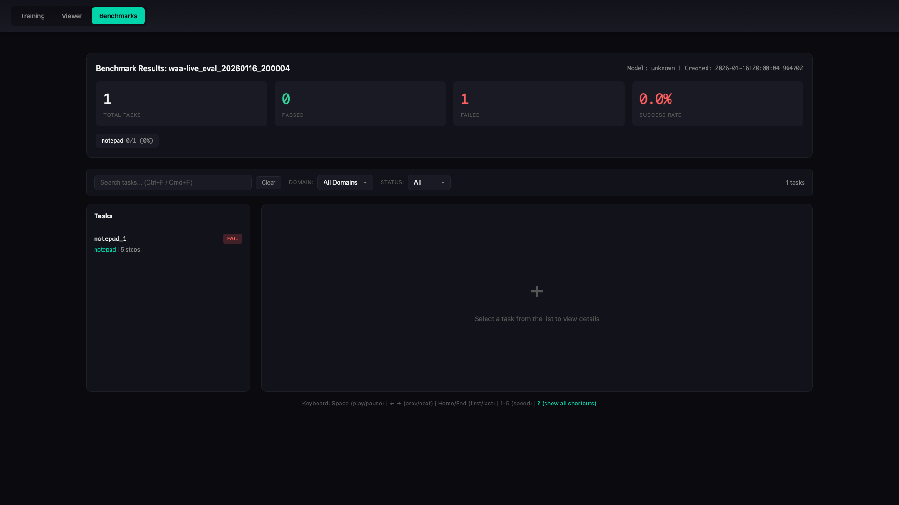
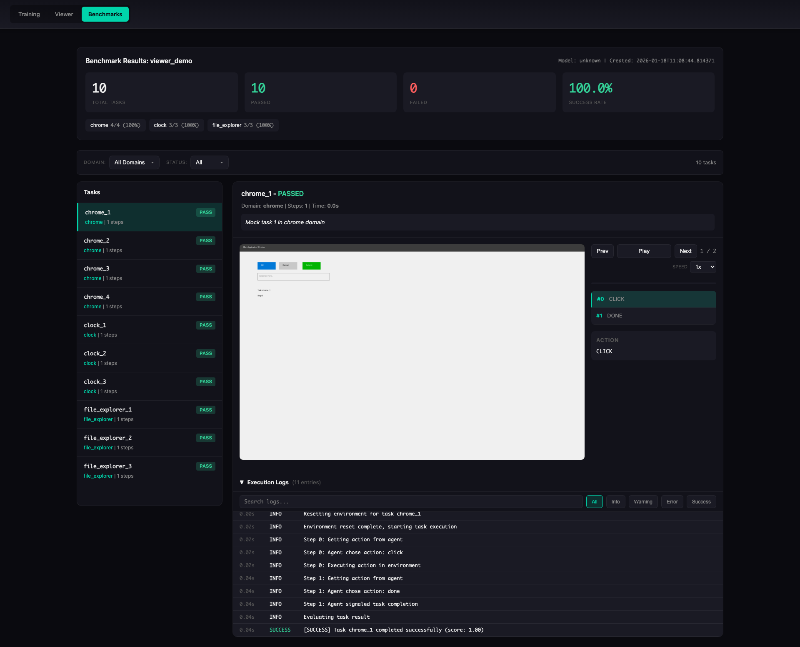
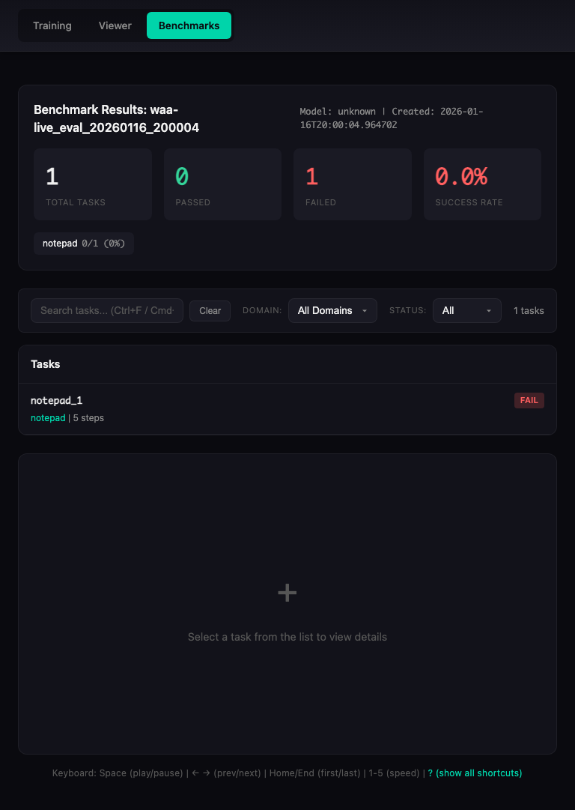
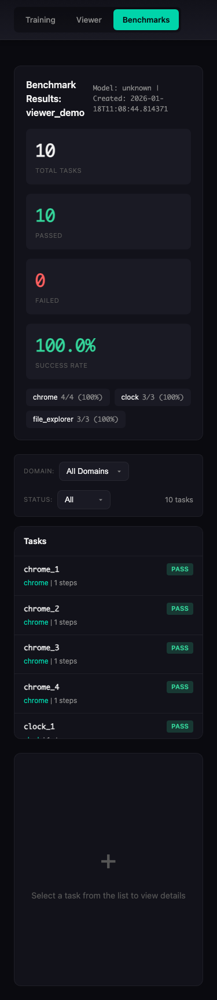

# OpenAdapt Evals

[](https://github.com/OpenAdaptAI/openadapt-evals/actions/workflows/publish.yml)
[](https://pypi.org/project/openadapt-evals/)
[](https://pypi.org/project/openadapt-evals/)
[](https://opensource.org/licenses/MIT)
[](https://www.python.org/downloads/)

Evaluation infrastructure for GUI agent benchmarks.

## Overview

`openadapt-evals` provides a unified framework for evaluating GUI automation agents across standardized benchmarks like Windows Agent Arena (WAA), OSWorld, WebArena, and others.

## Installation

```bash
pip install openadapt-evals
```

Or with uv:
```bash
uv add openadapt-evals
```

## Quick Start

```python
from openadapt_evals import (
    WAAMockAdapter,
    SmartMockAgent,
    evaluate_agent_on_benchmark,
    compute_metrics,
)

# Create mock adapter for testing (no Windows VM required)
adapter = WAAMockAdapter(num_tasks=10)

# Create agent
agent = SmartMockAgent()

# Run evaluation
results = evaluate_agent_on_benchmark(agent, adapter, max_steps=15)

# Compute metrics
metrics = compute_metrics(results)
print(f"Success rate: {metrics['success_rate']:.1%}")
```

## Core Concepts

### BenchmarkAdapter

Abstract interface for benchmark integration. Implementations:
- `WAAAdapter` - Windows Agent Arena (requires WAA repository)
- `WAAMockAdapter` - Mock adapter for testing without Windows

### BenchmarkAgent

Abstract interface for agents to be evaluated. Implementations:
- `ScriptedAgent` - Follows predefined action sequence
- `RandomAgent` - Takes random actions (baseline)
- `SmartMockAgent` - Designed to pass mock adapter tests

### Data Classes

- `BenchmarkTask` - Task definition (instruction, domain, etc.)
- `BenchmarkObservation` - Screenshot, accessibility tree, context
- `BenchmarkAction` - Click, type, scroll, key actions
- `BenchmarkResult` - Success/failure, score, trajectory

## Benchmark Viewer

Generate an HTML viewer for benchmark results:

```python
from openadapt_evals import generate_benchmark_viewer
from pathlib import Path

# Run evaluation with trace collection
from openadapt_evals import EvaluationConfig

config = EvaluationConfig(
    save_execution_traces=True,
    output_dir="benchmark_results",
    run_name="my_eval_run",
)

results = evaluate_agent_on_benchmark(agent, adapter, config=config)

# Generate viewer
generate_benchmark_viewer(
    benchmark_dir=Path("benchmark_results/my_eval_run"),
    output_path=Path("benchmark_results/my_eval_run/viewer.html"),
)
```

The viewer provides:
- Summary statistics (success rate, per-domain breakdown)
- Task list with pass/fail status
- Step-by-step replay with screenshots
- Action and reasoning display
- Playback controls (play/pause, speed, seek)
- Execution logs with filtering and search

### Viewer Screenshots

**Overview Panel**

Desktop view showing summary statistics and domain breakdown:



**Task Detail View**

Step-by-step task execution with screenshot replay:



**Execution Logs**

Detailed execution logs with filtering and search capabilities:


**Responsive Design**

The viewer works on all devices:

| Desktop (1920x1080) | Tablet (768x1024) | Mobile (375x667) |
|---------------------|-------------------|------------------|
|  |  |  |

### Generating Viewer Screenshots

Automatically capture screenshots of the viewer in multiple viewports:

```bash
# Install Playwright (required for screenshots)
pip install playwright
playwright install chromium

# Generate screenshots
python -m openadapt_evals.benchmarks.auto_screenshot \
    --html-path benchmark_results/my_eval_run/viewer.html \
    --output-dir screenshots \
    --viewports desktop tablet mobile \
    --states overview task_detail log_expanded log_collapsed
```

Or programmatically:

```python
from openadapt_evals.benchmarks.auto_screenshot import generate_screenshots

screenshots = generate_screenshots(
    html_path="benchmark_results/my_eval_run/viewer.html",
    output_dir="screenshots",
    viewports=["desktop", "tablet", "mobile"],
    states=["overview", "task_detail", "log_expanded", "log_collapsed"],
)
```

## Custom Agents

Implement the `BenchmarkAgent` interface:

```python
from openadapt_evals import BenchmarkAgent, BenchmarkAction, BenchmarkObservation, BenchmarkTask

class MyAgent(BenchmarkAgent):
    def act(
        self,
        observation: BenchmarkObservation,
        task: BenchmarkTask,
        history: list[tuple[BenchmarkObservation, BenchmarkAction]] | None = None,
    ) -> BenchmarkAction:
        # Your agent logic here
        return BenchmarkAction(type="click", x=0.5, y=0.5)

    def reset(self) -> None:
        # Reset agent state between tasks
        pass
```

## Windows Agent Arena Integration

### Command Line Interface

The package provides a CLI for running WAA evaluations:

```bash
# Run mock evaluation (no Windows VM required)
python -m openadapt_evals.benchmarks.cli mock --tasks 10

# Check if WAA server is ready
python -m openadapt_evals.benchmarks.cli probe --server http://vm-ip:5000

# Run live evaluation against a WAA server
python -m openadapt_evals.benchmarks.cli live --server http://vm-ip:5000 --task-ids notepad_1,notepad_2

# Generate HTML viewer for results
python -m openadapt_evals.benchmarks.cli view --run-name my_eval_run

# Estimate Azure costs
python -m openadapt_evals.benchmarks.cli estimate --tasks 154 --workers 10
```

### Live WAA Adapter

Connect to a WAA Flask server running inside a Windows VM:

```python
from openadapt_evals import WAALiveAdapter, WAALiveConfig

# Configure connection to WAA server
config = WAALiveConfig(
    server_url="http://vm-ip:5000",
    a11y_backend="uia",  # or "win32"
    max_steps=15,
)

# Create adapter
adapter = WAALiveAdapter(config)

# Check connection
if not adapter.check_connection():
    print("WAA server not ready")

# Run evaluation
results = evaluate_agent_on_benchmark(agent, adapter, task_ids=["notepad_1"])
```

### Local WAA Evaluation

For real WAA evaluation with local WAA repository:

```python
from openadapt_evals import WAAAdapter

adapter = WAAAdapter(waa_repo_path="/path/to/WindowsAgentArena")
tasks = adapter.list_tasks(domain="notepad")

results = evaluate_agent_on_benchmark(agent, adapter, task_ids=[t.task_id for t in tasks[:5]])
```

### Azure-based Parallel Evaluation

Run WAA at scale using Azure ML compute:

```bash
# Install Azure dependencies
pip install openadapt-evals[azure]

# Set environment variables
export AZURE_SUBSCRIPTION_ID="your-subscription-id"
export AZURE_ML_RESOURCE_GROUP="your-resource-group"
export AZURE_ML_WORKSPACE_NAME="your-workspace"

# Run evaluation with multiple workers
python -m openadapt_evals.benchmarks.cli azure \
    --waa-path /path/to/WindowsAgentArena \
    --workers 10 \
    --timeout-hours 4
```

Or programmatically:

```python
from openadapt_evals.benchmarks.azure import AzureConfig, AzureWAAOrchestrator

config = AzureConfig.from_env()
orchestrator = AzureWAAOrchestrator(
    config=config,
    waa_repo_path="/path/to/WindowsAgentArena",
)

results = orchestrator.run_evaluation(
    agent=my_agent,
    num_workers=40,  # 40 parallel VMs
    cleanup_on_complete=True,
)
```

### Live Monitoring

Monitor Azure ML jobs in real-time with auto-refreshing viewer:

```bash
# Install viewer dependencies
pip install openadapt-evals[viewer]

# Start an Azure evaluation (in terminal 1)
python -m openadapt_evals.benchmarks.cli azure \
    --workers 1 \
    --task-ids notepad_1,browser_1 \
    --waa-path /path/to/WAA

# Monitor job logs in real-time (in terminal 2)
python -m openadapt_evals.benchmarks.cli azure-monitor \
    --job-name waa-waa3718w0-1768743963-20a88242 \
    --output benchmark_live.json

# Start live viewer API (in terminal 3)
python -m openadapt_evals.benchmarks.live_api \
    --live-file benchmark_live.json \
    --port 5001

# Open http://localhost:5001 in browser to see live progress!
```

Features:
- Real-time log streaming from Azure ML jobs
- Auto-refreshing viewer with "LIVE" indicator
- Task/step progress tracking
- No need to wait for job completion

See [LIVE_MONITORING.md](./LIVE_MONITORING.md) for full documentation.

## API Reference

### Evaluation Functions

- `evaluate_agent_on_benchmark(agent, adapter, ...)` - Run evaluation
- `compute_metrics(results)` - Aggregate metrics (success_rate, avg_score, etc.)
- `compute_domain_metrics(results, tasks)` - Per-domain metrics

### Data Collection

- `ExecutionTraceCollector` - Collect execution traces during evaluation
- `save_execution_trace(task, result, trajectory, ...)` - Save single trace

### Utilities

- `action_to_string(action)` - Convert action to readable string
- `format_accessibility_tree(tree)` - Format a11y tree for display
- `parse_action_response(response)` - Parse VLM response to action

## License

MIT

## Related Projects

- [openadapt-ml](https://github.com/OpenAdaptAI/openadapt-ml) - Training and policy runtime
- [openadapt-grounding](https://github.com/OpenAdaptAI/openadapt-grounding) - UI element localization
- [openadapt-capture](https://github.com/OpenAdaptAI/openadapt-capture) - Screen recording
