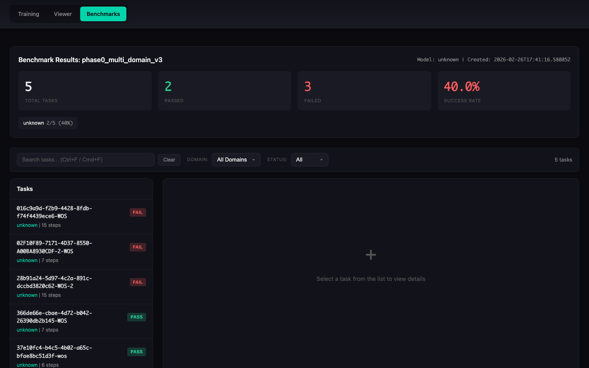
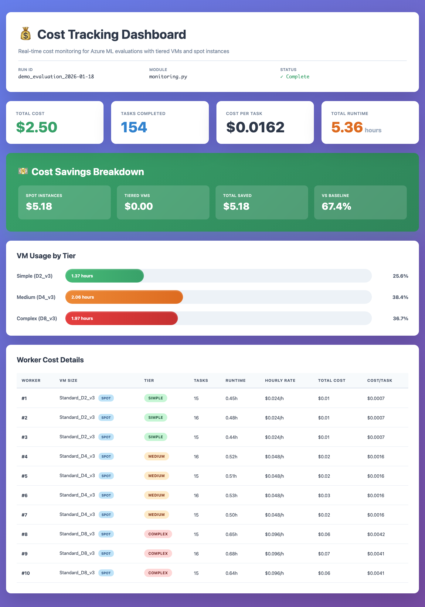

# OpenAdapt Evals

[](https://github.com/OpenAdaptAI/openadapt-evals/actions/workflows/test.yml)
[](https://github.com/OpenAdaptAI/openadapt-evals/actions/workflows/release.yml)
[](https://pypi.org/project/openadapt-evals/)
[](https://www.python.org/downloads/)
[](https://opensource.org/licenses/MIT)

Evaluation infrastructure for GUI agent benchmarks, built for [OpenAdapt](https://github.com/OpenAdaptAI/OpenAdapt).

## What is OpenAdapt Evals?

OpenAdapt Evals is a unified framework for evaluating GUI automation agents against standardized benchmarks such as [Windows Agent Arena (WAA)](https://microsoft.github.io/WindowsAgentArena/). It provides benchmark adapters, agent interfaces, Azure VM infrastructure for parallel evaluation, and result visualization -- everything needed to go from "I have a GUI agent" to "here are its benchmark scores."

## Benchmark Viewer



<details>
<summary>More screenshots</summary>

**Task Detail View** -- step-by-step replay with screenshots, actions, and execution logs:


**Cost Tracking Dashboard** -- real-time Azure VM cost monitoring with tiered sizing and spot instances:



</details>

## Key Features

- **Benchmark adapters** for WAA (live, mock, and local modes), with an extensible base for OSWorld, WebArena, and others
- **Agent interfaces** including `ApiAgent` (Claude / GPT), `ClaudeComputerUseAgent`, `RetrievalAugmentedAgent`, `RandomAgent`, and `PolicyAgent`
- **Azure VM infrastructure** with `AzureVMManager`, `PoolManager`, `SSHTunnelManager`, and `VMMonitor` for running evaluations at scale
- **CLI tools** -- `oa-vm` for VM and pool management (50+ commands), benchmark CLI for running evals
- **Cost optimization** -- tiered VM sizing, spot instance support, and real-time cost tracking
- **Results visualization** -- HTML viewer with step-by-step screenshot replay, execution logs, and domain breakdowns
- **Trace export** for converting evaluation trajectories into training data
- **Configuration via pydantic-settings** with automatic `.env` loading

## Installation

```bash
pip install openadapt-evals
```

With optional dependencies:

```bash
pip install openadapt-evals[azure]      # Azure VM management
pip install openadapt-evals[retrieval]  # Demo retrieval agent
pip install openadapt-evals[viewer]     # Live results viewer
pip install openadapt-evals[all]        # Everything
```

## Quick Start

### Run a mock evaluation (no VM required)

```bash
openadapt-evals mock --tasks 10
```

### Run a live evaluation against a WAA server

```bash
# Start with a single Azure VM
oa-vm pool-create --workers 1
oa-vm pool-wait

# Run evaluation
openadapt-evals run --agent api-claude --task notepad_1

# View results
openadapt-evals view --run-name live_eval

# Clean up (stop billing)
oa-vm pool-cleanup -y
```

### Python API

```python
from openadapt_evals import (
    ApiAgent,
    WAALiveAdapter,
    WAALiveConfig,
    evaluate_agent_on_benchmark,
    compute_metrics,
)

adapter = WAALiveAdapter(WAALiveConfig(server_url="http://localhost:5001"))
agent = ApiAgent(provider="anthropic")

results = evaluate_agent_on_benchmark(agent, adapter, task_ids=["notepad_1"])
metrics = compute_metrics(results)
print(f"Success rate: {metrics['success_rate']:.1%}")
```

### Demo-conditioned evaluation

Record demos on a remote VM via VNC, annotate with a VLM, then run demo-conditioned eval:

```bash
# 1. Record demos interactively (perform actions on VNC, press Enter after each step)
python scripts/record_waa_demos.py record-waa \
  --tasks 04d9aeaf,0a0faba3 \
  --server http://localhost:5001 \
  --output waa_recordings/

# 2. Annotate recordings with VLM
python scripts/record_waa_demos.py annotate \
  --recordings waa_recordings/ \
  --output annotated_demos/ \
  --provider openai

# 3. Run demo-conditioned eval
python scripts/record_waa_demos.py eval \
  --demo_dir annotated_demos/ \
  --tasks 04d9aeaf,0a0faba3
```

### Parallel evaluation on Azure

```bash
# Create a pool of VMs and distribute tasks
oa-vm pool-create --workers 5
oa-vm pool-wait
oa-vm pool-run --tasks 50

# Or use Azure ML orchestration
openadapt-evals azure --workers 10 --waa-path /path/to/WindowsAgentArena
```

## Architecture

```
openadapt_evals/
├── agents/               # Agent implementations
│   ├── base.py           #   BenchmarkAgent ABC
│   ├── api_agent.py      #   ApiAgent (Claude, GPT)
│   ├── retrieval_agent.py#   RetrievalAugmentedAgent
│   └── policy_agent.py   #   PolicyAgent (trained models)
├── adapters/             # Benchmark adapters
│   ├── base.py           #   BenchmarkAdapter ABC + data classes
│   └── waa/              #   WAA live, mock, and local adapters
├── infrastructure/       # Azure VM and pool management
│   ├── azure_vm.py       #   AzureVMManager
│   ├── pool.py           #   PoolManager
│   ├── ssh_tunnel.py     #   SSHTunnelManager
│   └── vm_monitor.py     #   VMMonitor dashboard
├── benchmarks/           # Evaluation runner, CLI, viewers
│   ├── runner.py         #   evaluate_agent_on_benchmark()
│   ├── cli.py            #   Benchmark CLI (run, mock, live, view)
│   ├── vm_cli.py         #   VM/Pool CLI (oa-vm, 50+ commands)
│   ├── viewer.py         #   HTML results viewer
│   ├── pool_viewer.py    #   Pool results viewer
│   └── trace_export.py   #   Training data export
├── waa_deploy/           # Docker agent deployment
├── server/               # WAA server extensions
├── config.py             # Settings (pydantic-settings, .env)
└── __init__.py
```

### How it fits together

```
LOCAL MACHINE                          AZURE VM (Ubuntu)
┌─────────────────────┐                ┌──────────────────────┐
│  oa-vm CLI          │   SSH Tunnel   │  Docker              │
│  (pool management)  │ ─────────────> │  └─ QEMU (Win 11)   │
│                     │  :5001 → :5000 │     ├─ WAA Flask API │
│  openadapt-evals    │  :8006 → :8006 │     └─ Agent         │
│  (benchmark runner) │                │                      │
└─────────────────────┘                └──────────────────────┘
```

## CLI Reference

### Benchmark CLI (`openadapt-evals`)

| Command    | Description                                   |
|------------|-----------------------------------------------|
| `run`        | Run live evaluation (localhost:5001 default)   |
| `mock`       | Run with mock adapter (no VM required)         |
| `live`       | Run against a WAA server (full control)        |
| `eval-suite` | Automated full-cycle evaluation (ZS + DC)      |
| `azure`      | Run parallel evaluation on Azure ML            |
| `probe`      | Check if a WAA server is ready                 |
| `view`       | Generate HTML viewer for results               |
| `estimate`   | Estimate Azure costs                           |

### VM/Pool CLI (`oa-vm`)

| Command         | Description                              |
|-----------------|------------------------------------------|
| `pool-create`   | Create N VMs with Docker and WAA         |
| `pool-wait`     | Wait until WAA is ready on all workers   |
| `pool-run`      | Distribute tasks across pool workers     |
| `pool-status`   | Show status of all pool VMs              |
| `pool-pause`    | Deallocate pool VMs (stop billing)       |
| `pool-resume`   | Restart deallocated pool VMs             |
| `pool-cleanup`  | Delete all pool VMs and resources        |
| `image-create`  | Create golden image from a pool VM       |
| `image-list`    | List available golden images             |
| `vm monitor`    | Dashboard with SSH tunnels               |
| `vm setup-waa`  | Deploy WAA container on a VM             |

Run `oa-vm --help` for the full list of 50+ commands.

## Configuration

Settings are loaded automatically from environment variables or a `.env` file in the project root via [pydantic-settings](https://docs.pydantic.dev/latest/concepts/pydantic_settings/).

```bash
# .env
ANTHROPIC_API_KEY=sk-ant-...
OPENAI_API_KEY=sk-...

# Azure (required for VM management)
AZURE_SUBSCRIPTION_ID=...
AZURE_ML_RESOURCE_GROUP=...
AZURE_ML_WORKSPACE_NAME=...
```

See [`openadapt_evals/config.py`](openadapt_evals/config.py) for all available settings.

## Custom Agents

Implement the `BenchmarkAgent` interface to evaluate your own agent:

```python
from openadapt_evals import BenchmarkAgent, BenchmarkAction, BenchmarkObservation, BenchmarkTask

class MyAgent(BenchmarkAgent):
    def act(
        self,
        observation: BenchmarkObservation,
        task: BenchmarkTask,
        history: list[tuple[BenchmarkObservation, BenchmarkAction]] | None = None,
    ) -> BenchmarkAction:
        # Your agent logic here
        return BenchmarkAction(type="click", x=0.5, y=0.5)

    def reset(self) -> None:
        pass
```

## Contributing

We welcome contributions. To get started:

```bash
git clone https://github.com/OpenAdaptAI/openadapt-evals.git
cd openadapt-evals
uv sync --extra dev
uv run pytest tests/ -v
```

See [CLAUDE.md](./CLAUDE.md) for development conventions and architecture details.

## Related Projects

| Project | Description |
|---------|-------------|
| [OpenAdapt](https://github.com/OpenAdaptAI/OpenAdapt) | Desktop automation with demo-conditioned AI agents |
| [openadapt-ml](https://github.com/OpenAdaptAI/openadapt-ml) | Training and policy runtime |
| [openadapt-capture](https://github.com/OpenAdaptAI/openadapt-capture) | Screen recording and demo sharing |
| [openadapt-grounding](https://github.com/OpenAdaptAI/openadapt-grounding) | UI element localization |

## License

[MIT](https://opensource.org/licenses/MIT)
