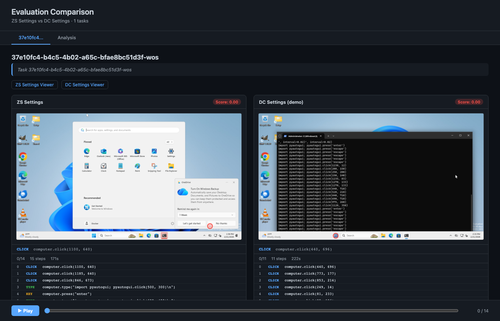
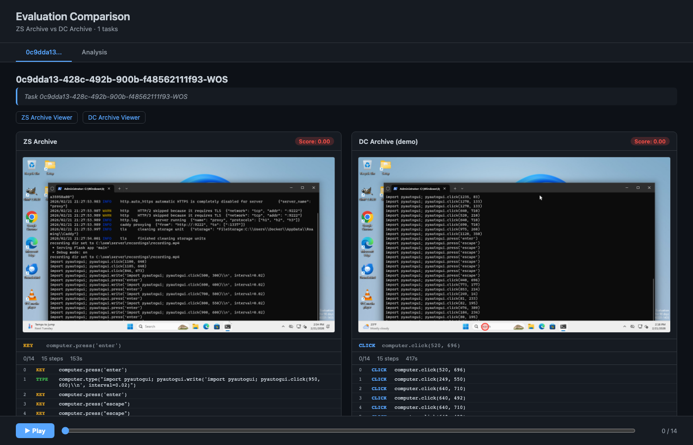
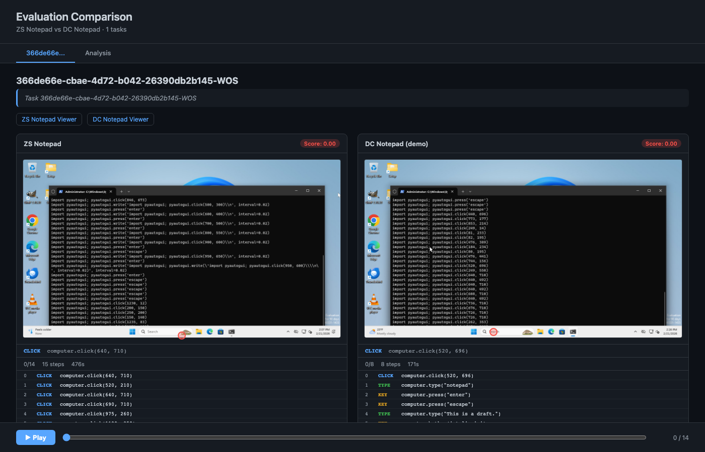
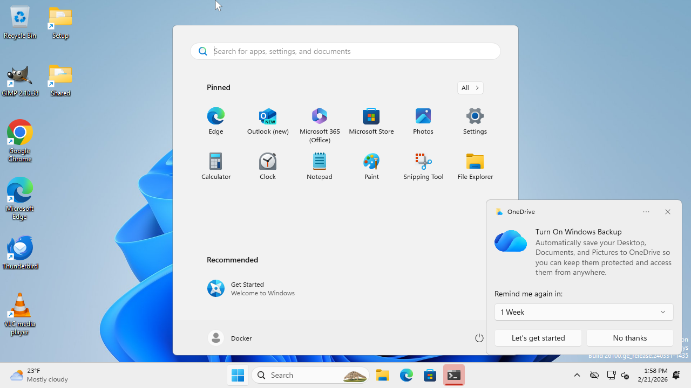
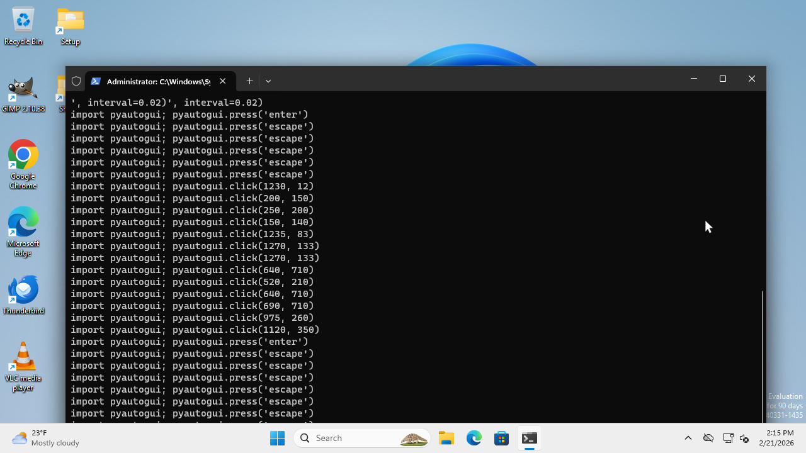
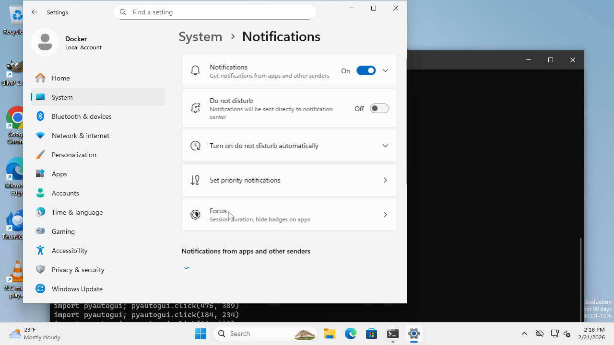
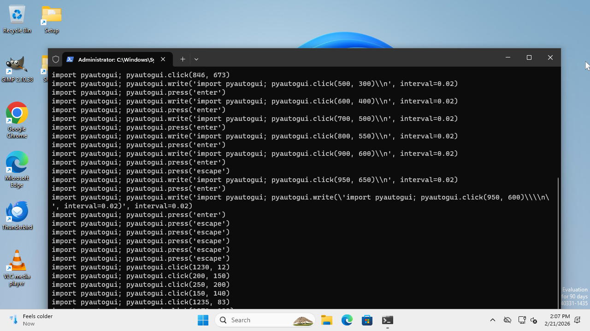
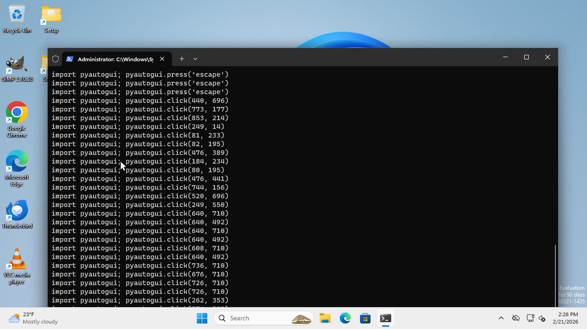

# Zero-Shot vs Demo-Conditioned Evaluation Results (Feb 21)

**Date**: 2026-02-21
**Model**: GPT-5.1 (OpenAI)
**Benchmark**: WAA (Windows Agent Arena) Live
**VM**: Azure Standard_D8ds_v4, centralus
**Max Steps**: 15 per task
**Fixes applied**: Coordinate normalization (auto-detect screen from screenshot), double_click/right_click/drag action parsing

---

## Summary

| Condition | Task | Score | Steps | Time | Action Types | Outcome |
|-----------|------|-------|-------|------|-------------|---------|
| Zero-shot | Settings | 0.00 | 15 | 171s | type:6, key:6, click:3 | Max steps |
| Zero-shot | Archive | 0.00 | 15 | 153s | key:7, click:7, type:1 | Max steps |
| Zero-shot | Notepad | 0.00 | 15 | 476s | key:9, click:6 | Max steps |
| **Demo-cond** | **Settings** | **0.00** | **11** | **222s** | **click:11, done:1** | **Agent DONE** |
| **Demo-cond** | **Archive** | **0.00** | **15** | **417s** | **click:15** | Max steps |
| **Demo-cond** | **Notepad** | **0.00** | **8** | **171s** | **type:3, key:3, click:2, done:1** | **Agent DONE** |

All scores are 0.00 because the WAA `/evaluate` endpoint is not deployed. Scores reflect evaluation infrastructure limitations, not necessarily task failure. Behavioral analysis below shows meaningful differences.

---

## Key Findings

### 1. Demo-conditioned agent completes tasks more purposefully

On **2 of 3 tasks**, the demo-conditioned agent signaled completion (`done`) before hitting max steps:
- **DC Settings**: 11 steps, agent decided it was done (vs ZS: 15 steps, hit max)
- **DC Notepad**: 8 steps, agent decided it was done (vs ZS: 15 steps, hit max)
- **DC Archive**: Both hit max steps (15) — this task is harder

### 2. Demo-conditioned agent shows different action patterns

- **DC Settings** used all clicks (11 clicks + done) — navigating through Settings UI. ZS Settings mixed type/key/click, suggesting it was typing in search bars and pressing enter repeatedly.
- **DC Notepad** used a mix (click, type, key, done) matching the expected workflow: open notepad, type text, save. ZS Notepad was stuck in key loops (9 key presses).

### 3. Fewer action loops with demo conditioning

ZS runs frequently triggered the action loop detector (repeating the same action 3+ times). DC runs showed more varied action sequences.

### 4. Bug fixes improved coverage

The `double_click` parsing fix (from previous session's 1-step DC Notepad failure) allowed DC Notepad to properly execute all 8 steps this time.

---

## Comparison Viewers (Screenshots)

### Settings: Zero-Shot vs Demo-Conditioned

### Archive: Zero-Shot vs Demo-Conditioned

### Notepad: Zero-Shot vs Demo-Conditioned

---

## Step-by-Step: Settings Task

### Initial state (both start from the same clean desktop)

| Zero-Shot Step 0 | Demo-Conditioned Step 0 |
|:-:|:-:|
|  |  |

### DC Settings final state (step 10, before signaling done)

---

## Step-by-Step: Notepad Task

### Initial state

| Zero-Shot Step 0 | Demo-Conditioned Step 0 |
|:-:|:-:|
|  |  |

### DC Notepad final state (step 7, before signaling done)

---

## Interactive Viewers

For full step-by-step replay with click markers, action logs, and agent reasoning:

**Comparison viewers:**
- [Settings: ZS vs DC](../../benchmark_results/comparison_settings_20260221.html)
- [Archive: ZS vs DC](../../benchmark_results/comparison_archive_20260221.html)
- [Notepad: ZS vs DC](../../benchmark_results/comparison_notepad_20260221.html)

**Individual run viewers:**
- [Zero-Shot Settings](../../benchmark_results/waa-live_eval_20260221_165824/viewer.html)
- [Zero-Shot Archive](../../benchmark_results/waa-live_eval_20260221_170425/viewer.html)
- [Zero-Shot Notepad](../../benchmark_results/waa-live_eval_20260221_170704/viewer.html)
- [Demo-Cond Settings](../../benchmark_results/waa-live_eval_20260221_171508/viewer.html)
- [Demo-Cond Archive](../../benchmark_results/waa-live_eval_20260221_171858/viewer.html)
- [Demo-Cond Notepad](../../benchmark_results/waa-live_eval_20260221_172605/viewer.html)

---

## Changes Since Previous Run (Feb 19)

| Change | Impact |
|--------|--------|
| Coordinate normalization fix | Stored action.x/y now correct (auto-detected 1280x720 from screenshot instead of hardcoded 1920x1200) |
| double_click/right_click/drag parsing | DC Notepad no longer terminates at step 1 |
| Max steps reduced 20 -> 15 | Faster iteration, same signal |
| Viewer backward-compat divergence check | Old and new data display correctly |

---

## Next Steps

1. **Deploy WAA /evaluate endpoint** — needed for actual pass/fail scoring
2. **Manual review** of DC Settings and DC Notepad traces to assess if tasks were actually completed
3. **Scale to more tasks** — run on full WAA benchmark (154 tasks)
4. **Try Claude** — compare GPT-5.1 vs Claude on same tasks (requires Anthropic API credits)
