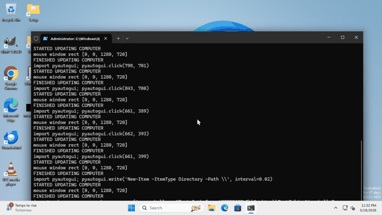
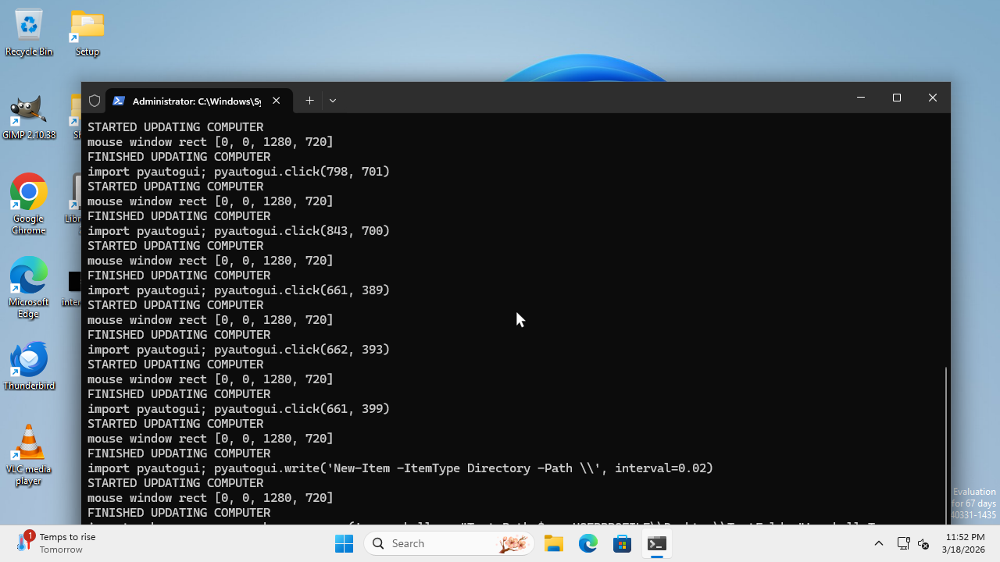
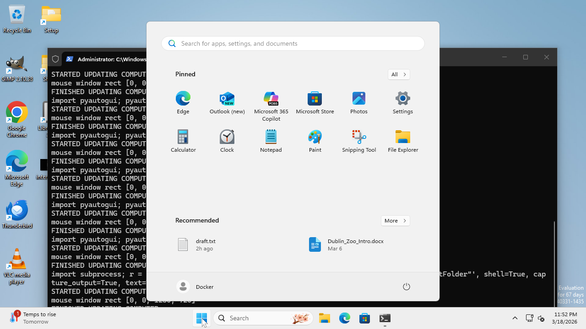
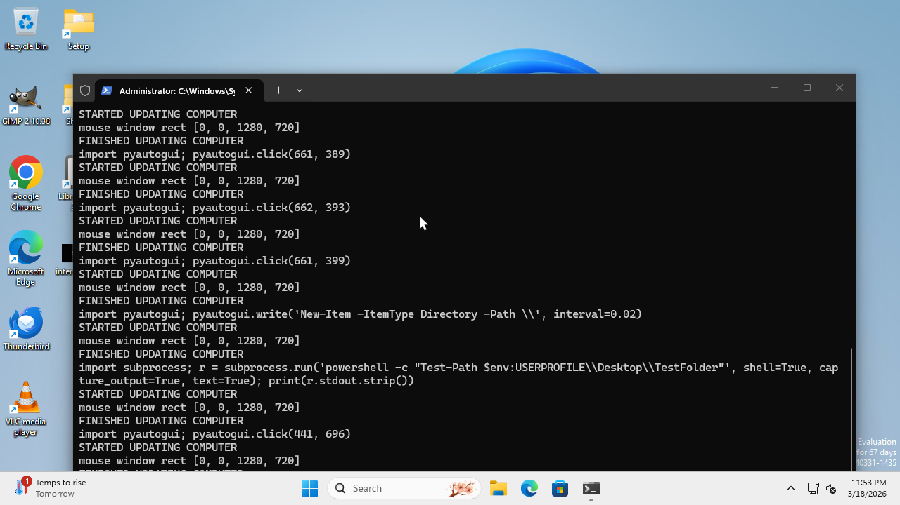
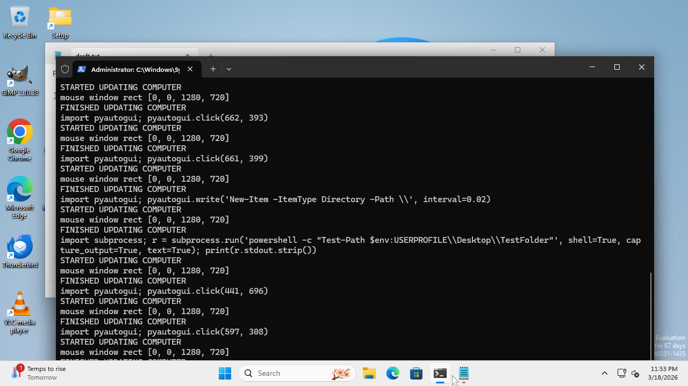
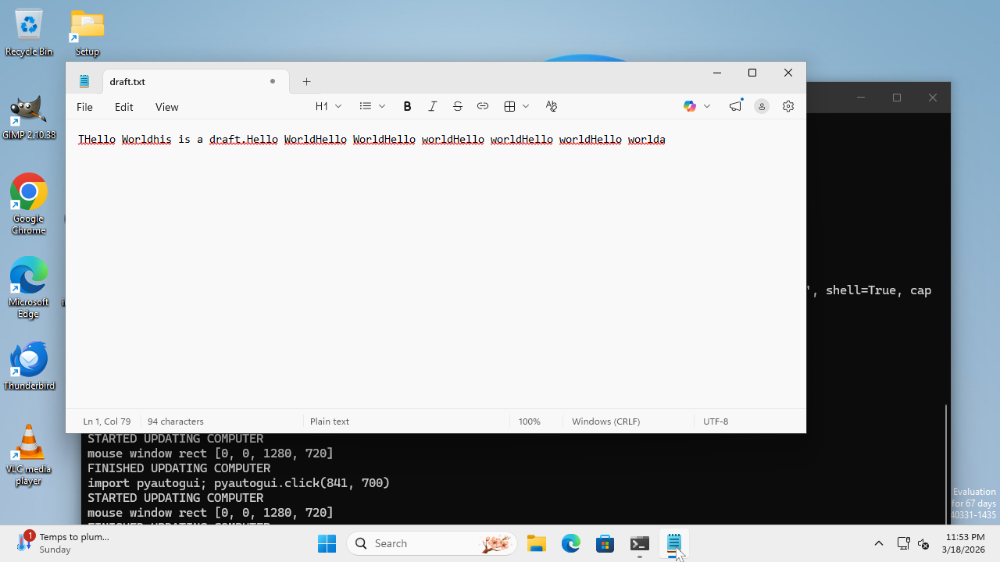
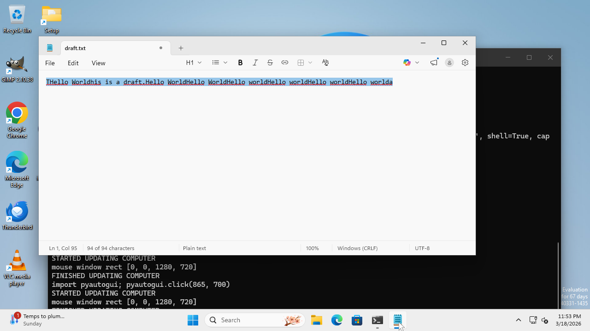

# Execution Trace: Open Notepad and Type Hello World

> Date: 2026-03-18
> Score: Task functionally completed (VLM judge scored 0 due to Win11 Notepad not recognized)
> Steps: 6
> Time: 101.4s
> Planner: Claude Sonnet 4.6
> Grounder: UI-Venus-1.5-8B (vLLM on A10G)

## Step-by-Step

### Step 0 (Reset)
Desktop after closing all windows and killing previous Notepad instances.

### Step 1
**Planner**: Click the Start button in the taskbar
**Grounder**: [325, 943, 365, 992] (Start button bbox)
**Result**: Start menu opened

### Step 2
**Planner**: Click the Notepad icon in the Start menu
**Grounder**: [442, 386, 491, 472] (Notepad icon in pinned apps)
**Result**: Notepad launched

### Step 3
**Planner**: Click the Notepad taskbar button to bring it to focus
**Grounder**: [645, 955, 670, 992] (Notepad taskbar button)
**Result**: Notepad focused (was behind Terminal)

### Step 4
**Planner**: Click the Notepad taskbar button again
**Grounder**: [666, 955, 686, 992]
**Result**: Notepad confirmed in foreground

### Step 5
**Planner**: press Ctrl+A
**Action**: `pyautogui.hotkey('ctrl', 'a')` (select all existing text)
**Result**: All text in Notepad selected

### Step 6
**Planner**: type 'Hello World'
**Action**: `pyautogui.write('Hello World', interval=0.02)` (replaces selected text)
**Result**: "Hello World" typed, replacing previous content
**Planner confirms**: "11 characters at Line 1, Column 12" matches "Hello World"

## Architecture Validated

This trace demonstrates:
1. Claude (planner) correctly reasons about multi-step desktop tasks
2. UI-Venus (grounder) returns accurate bounding boxes for all UI elements
3. Non-click actions (Ctrl+A, typing) are correctly parsed from planner instructions
4. The planner handles existing content by selecting all then replacing
5. The planner recognizes task completion and signals DONE
